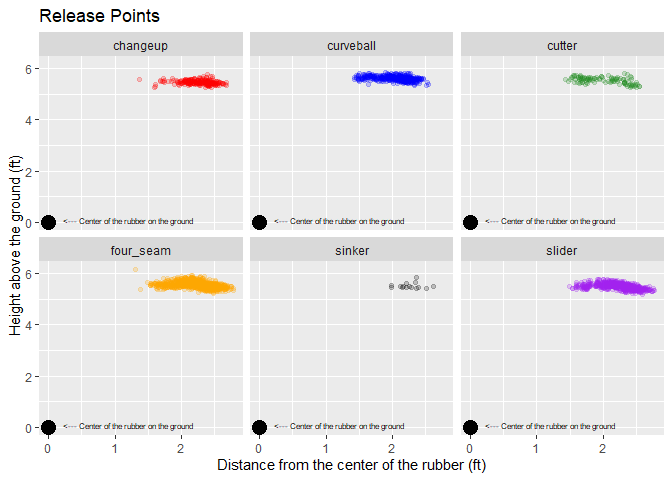
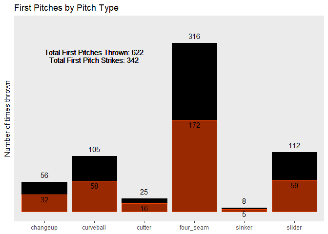
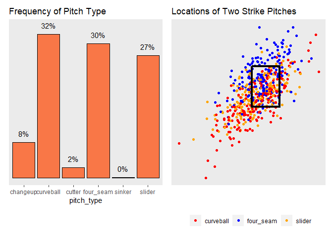
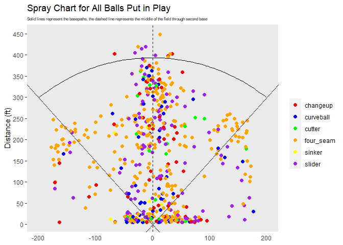
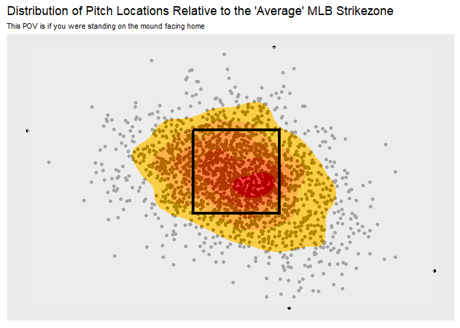
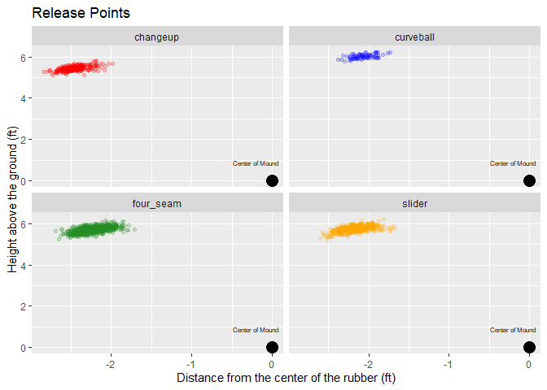
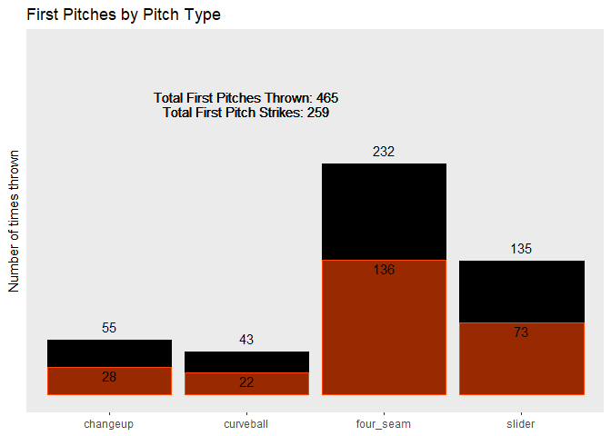
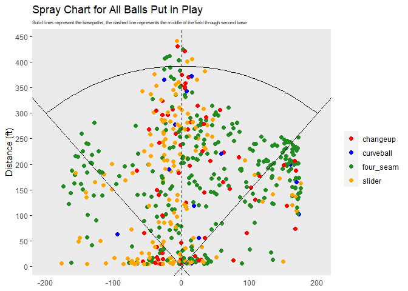

Pitcher Analysis
================
Drew Colbert

# Quick Summary

Pitcher A is a right hander who has an arsenal containing a four seam,
curveball, slider, changeup, cutter, and sinker. He mainly relies on
four seam, curveball, and slider. His four seam has a lot of bite to it,
almost like a two seam fastball and his go-to pitch to try and get a
first pitch strike, which he is successful at doing 55% of the time. His
slider is his go-to offspeed pitch in just about any situation, he can
throw it for a strike or he can add some extra movement on it to try and
get you to chase. His real put-away pitch is his loopy curveball, he
throws this pitch the most in counts with two strikes and he throws it
almost exclusively down and away to right-handed hitters to try and get
them to chase. He is not as confident in throwing it for a strike, as
his usage goes down considerably in counts where he is behind. Overall,
if you can get on this guy early and avoid all the junk he throws
outside of the strike zone, you can get after him to all parts of the
field.

Pitcher B is left hander with an arsenal of four seam, slider,
curveball, changeup. Majority of the time he is throwing his four seam
or his slider. He is a Chris Sale type, with a solid fastball that tails
a lot and shifty slider that he throws towards the back leg of a righty.
With two strikes you can expect either a high fastball or a slider that
is towards the bottom right corner of the strike zone. One of his best
abilities is the way he throws the fastball and slider from the same
spot. This makes it extremely difficult for a hitter to read the ball
coming out of his hand. The biggest downfall of pitcher B is his lack of
a third pitch. The fastball and slider are good and can work, but having
that third pitch, like a changeup, nailed down would take him to the
next level. He doesn’t throw it much, but when he does there isn’t much
drop to it, which makes it a hanging ball that any hitters eyes will
light up for. He seems like when he’s on, he’s untouchable. But if just
one pitch isn’t feeling right, he might be in trouble.

## Full Breakdown

### Pitcher A

    Pitcher A has a wide array of pitches under his belt that he will
throw, but the most common are four seam, slider, and curveball with a
pretty healthy mix changeups in there as well.

    ##    Pitch Type Ave Pitch Speed Total Thrown Usage %
    ## 1:   changeup            88.2          250     10%
    ## 2:  curveball            84.4          476     20%
    ## 3:     cutter            85.8          108      4%
    ## 4:  four_seam            93.3          962     40%
    ## 5:     sinker            92.6           15      1%
    ## 6:     slider            84.7          609     25%

Pitcher A tends to work two parts of the zone: low-and-away to
right-handed hitters and up-and-in to right handed hitters. Other than
that there seems to be some reluctance to throw the ball to any other
part of the zone.  

   

Pitcher A tends to attack both sides of the plate the same way. Still
wants to work those two corners of the zone regardless of what side the
batter is on.  

   

#### Individual Pitch Breakdown

   

The release point actually tends to have quite a bit of variation. His
4-seam can come from an over-the-top angle, but will more often than not
be anywhere around a 3/4 release point. What you may notice though is
that the curveball generally comes from over-the-top where the slider
will most likely come from the 3/4 release point. Now this make sense
considering the goal of each pitch, the curveball is going to have more
vertical break whereas the slider is going to have more horizontal break
to it. As a hitter, this would be something you could pick up on and be
able to recognize which pitch may be coming.

   

Here is a breakdown for the vertical and horizontal movement of each
pitch. The most surprising thing on this chart is the horizontal break
of the fastball. There tends to be quite a lot of bite to his fastball
and it seems to move more like a two-seam fastball instead of a
four-seam fastball. Another thing to note is that his curveball is a big
looping curve that has a lot of movement but could most likely be
adjusted to by a hitter. Whereas the slider has a lot of variability to
it, showing a large range of movement, which depends on the situation.
In fact, with two strikes, there is significantly more horizontal and
vertical break on slider slider, presumably trying to get the hitter to
chase one out of the zone compared to when there is less than two
strikes in a count.    

#### Pitcher Tendencies

    To start an at bat, his fastball is typically his go-to pitch to try
and get one over and get ahead of the count, choosing this pitch about
half of the time. He will occasionally go to an offspeed pitch to mix it
up and pretty consistently throws an actual strike 55% of the time,
regardless of what pitch.    

    After that first pitch, he seems to stick to the same tendencies as
before. Reliance on the fastball mostly with a healthy dose of
curveballs and sliders in the mix. Being behind in the count he is less
open to throwing his curveball compared to any other count type, leading
me to believe that he is not as confident in throwing his curveball for
a strike and he uses this as mainly a strikeout pitch to get guys
chasing. He relies heavily on his fastball throughout all counts and he
throws the slider more in counts where he’s behind or even, which is a
sign he is confident he can throw it for a strike in any count to mix up
the batters timing.    

    ##   Pitch Type Ahead Behind Even
    ## 1   changeup    62     77  111
    ## 2  curveball   160     97  219
    ## 3     cutter    14     48   46
    ## 4  four_seam   191    306  465
    ## 5     sinker     4      3    8
    ## 6     slider   154    230  225

 

When he gets into a two strike count, he goes to his three favorite
pitches about the same amount of times, with the curveball just edging
out the fastball. This again confirms that his curveball seems to be his
put-away pitch. When he does go offspeed, he usually throws it down and
away to righties, which is not uncommon for pitchers to do. Another
common trend is that he throws his fastball up in the zone when trying
to get guys out. Both of these are common to a pitcher as a put-away
pitch and he follows suit.    

    To wrap up, this spray chart shows where hitters typically hit each
pitch. Notice how the fastball gets sprayed all over the field, this
could be due in part because he throws more, but also because of his
reliance to it on the first pitch. Guys may jump all over the first
pitch fastball if they’re expecting it and are able to put it in play.
It is also worth pointing out that his offspeed pitches are typically
being fouled off or hit back up the middle. Given that he exclusively
throws it low and away to a right handed hitter or down and in to a
lefty, it shows that hitters are trying to foul off the junk and make
him come in with something hard, or doing what they can with the outside
curve and try to go the opposite way.    

------------------------------------------------------------------------

### Pitcher B

Pitcher B throws four pitches but mostly relies on just the four seam
and slider to get by with the occasional changeup to mix it up and very
rarely throws his curveball. There is a drastic speed difference between
his four seam and his slider with nearly a 15mph difference between the
two.    

    ##    Pitch Type Ave Pitch Speed Total Thrown Usage %
    ## 1:   changeup            85.3          280     15%
    ## 2:  curveball            71.9           76      4%
    ## 3:  four_seam            93.5          935     49%
    ## 4:     slider            79.9          604     32%

    He is not afraid to throw anywhere around the plate, with a good mix
of inside and out, and up and down. He favors down and away to a lefty
hitter but that is most likely because of the slider that he throwing.  
 

    In terms of lefty vs righty, he does not seem to attack either side
any different in terms of location, keeping it pretty consistant with
both.    

   

#### Individual Pitch Breakdown

His release point is very consistant throughout all of his pitches.
There is almost no difference in the release point between his fastball
and his slider which is where he makes his living. This is a really good
sign as a pitcher, it’ll be very difficult to tell what pitch is coming
when they all come out of his hand the same way.    

    His movement is probably what you would expect from a lefty. A lot
of tail to his four seam that cuts in on a lefty and a huge sweeping
slider. The slider is mosty horizontal break and very little vertical
break. So that is a pitch that might look like a fastball out of the
hand but then it just runs away from you. Also note that the changeup
has a lot of horizontal break to it but very little vertical break to
it, this tells me that if he misses his spot with that pitch it is going
to hang there for someone to hit a long way. This is something to watch
out for and work on.    

   

#### Pitcher Tendencies

He likes to use his top two pitches to get ahead in the count, mainly
his fastball. He is throwing a first pitch strike about 55% of the time.
   

    Whether he’s ahead, behind, or even in the count, his pitch
selection remains almost the same. He uses the slider just a little bit
more when he is ahead in the count, but not by much, showing me that he
is confident that he can throw it for a strike when he needs to.    

    ##   Pitch Type Ahead Behind Even
    ## 1   changeup    62     89  129
    ## 2  curveball     7     23   46
    ## 3  four_seam   248    315  372
    ## 4     slider   185    152  265

    With two strikes, it is no surprise what pitches he is going to turn
to and where he is going to throw them most often. He is going to throw
a slider at the back leg of a right handed hitter or away from a lefty
and he tends to go high fastball as well for a put out pitch. This is a
good combination to have where you can really change the eye level of
the hitter with two very different pitches.    

    Finally, the spray chart shows that his fastball is most often being
hit to the right side of the field, with a lot of balls seeming to go
right down the first base line. As we showed with the movement, his four
seam is going to be tailing away from a right handed hitter so when they
see that, they are going to go with the pitch and go the other way. His
slider mostly gets hit to the left side or up the middle, which is where
a left handed hitter’s only option is if he throws it correctly.    

