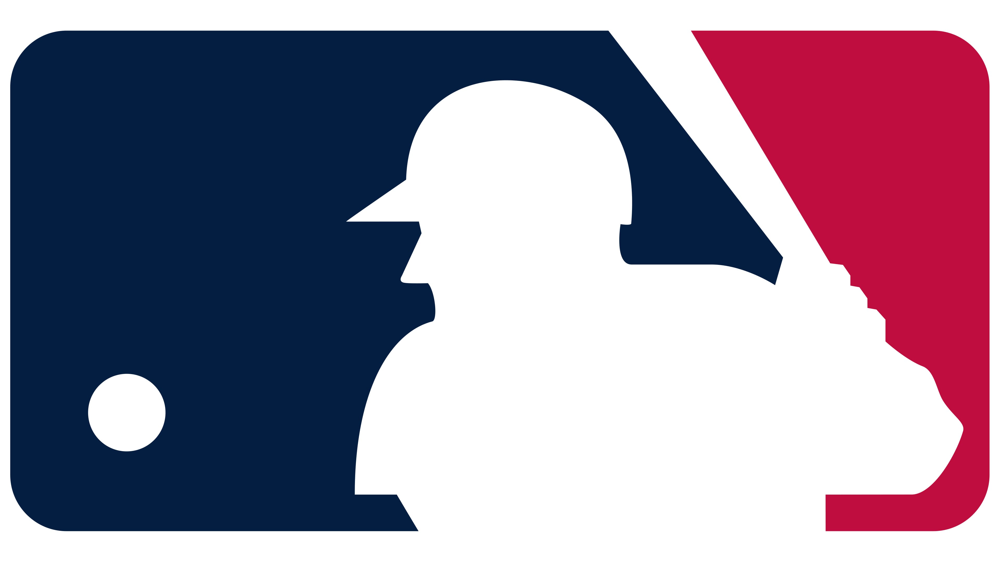

# MLB-Pitcher-Analysis
Detailed report of two active MLB pitchers, comparing tendencies and pitch styles

## Business Application
As an organization, it is vital to understand the tendancies and pitch styles of all pitchers in the league. Whether it is for signing free agents, evaluting memebers of the team, preparing a game plan for opposing teams, or deciding on a new draft prospect. Being able to effecitvely evaluate a player is going to be crucial. 

This report sets out to give an overview of these two pitchers and provide information about their poitch styles in an efficient manner. This report is intended for all audiences, both technical and non-technical. 

## OVerview of the Data
The data was presented as a csv file, containing statcast data for 2200 individual pitches for each pitcher. The data takes place over multiple games, against multiple teams. 
The csv contains the follwoing data about the pitch and the situation the pitch took place in:
- pitch_id
- pitcher_id
- pa_of_inning
- pitch_of_pa
- inning
- outs
- balls
- strikes
- batter_side
- pitcher_throws
- pitch_type
- pitch_call
- rel_speed
- spin_rate
- tilt
- rel_height
- rel_side
- extension
- vert_break
- induced_vert_break
- horz_break
- plate_loc_height
- plate_loc_side
- strike_prob
- runner_on_first_id
- runner_on_second_id
- runner_on_third_id
- post_runner_on_first_id
- post_runner_on_second_id
- post_runner_on_third_id	hit_type
- play_result	direction	exit_speed
- angle	distance
- bearing
- venue

A description of this data can be found [here.](https://baseballsavant.mlb.com/csv-docs)

## Project Conclusion

Pitcher A is a right hander who has an arsenal containing a four seam,
curveball, slider, changeup, cutter, and sinker. He mainly relies on
four seam, curveball, and slider. His four seam has a lot of bite to it,
almost like a two seam fastball and his go-to pitch to try and get a
first pitch strike, which he is successful at doing 55% of the time. His
slider is his go-to offspeed pitch in just about any situation, he can
throw it for a strike or he can add some extra movement on it to try and
get you to chase. His real put-away pitch is his loopy curveball, he
throws this pitch the most in counts with two strikes and he throws it
almost exclusively down and away to right-handed hitters to try and get
them to chase. He is not as confident in throwing it for a strike, as
his usage goes down considerably in counts where he is behind. Overall,
if you can get on this guy early and avoid all the junk he throws
outside of the strike zone, you can get after him to all parts of the
field.

Pitcher B is left hander with an arsenal of four seam, slider,
curveball, changeup. Majority of the time he is throwing his four seam
or his slider. He is a Chris Sale type, with a solid fastball that tails
a lot and shifty slider that he throws towards the back leg of a righty.
With two strikes you can expect either a high fastball or a slider that
is towards the bottom right corner of the strike zone. One of his best
abilities is the way he throws the fastball and slider from the same
spot. This makes it extremely difficult for a hitter to read the ball
coming out of his hand. The biggest downfall of pitcher B is his lack of
a third pitch. The fastball and slider are good and can work, but having
that third pitch, like a changeup, nailed down would take him to the
next level. He doesn't throw it much, but when he does there isn't much
drop to it, which makes it a hanging ball that any hitters eyes will
light up for. He seems like when he's on, he's untouchable. But if just
one pitch isn't feeling right, he might be in trouble.

 
 
 

View the full report [here.](MLB-Pitcher-Analysis.md)

View the code behind the report [here.](MLB-Pitcher-Analysis.Rmd)

